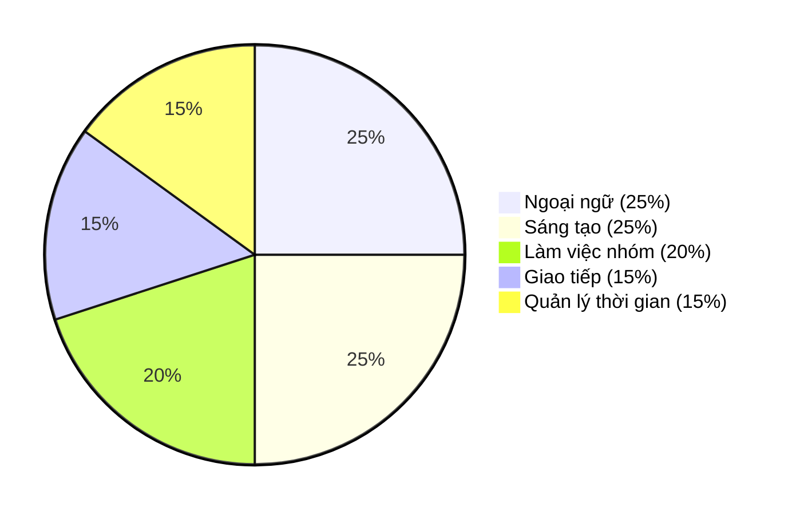
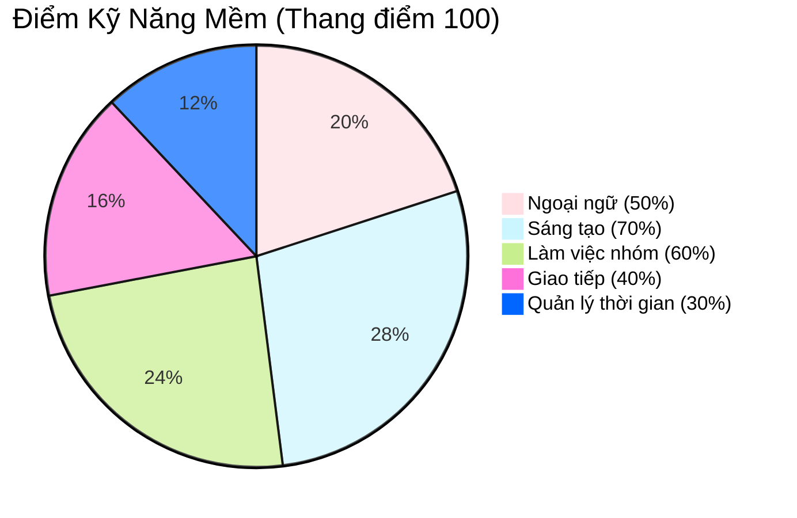

  

  

## Thông tin cá nhân

- Họ và tên: Vũ Hoàng Bảo Châu
- Sinh viên ngành Công nghệ Đa phương tiện, chuyên ngành Thiết kế Đa phương tiện  
- Học viện Công nghệ Bưu chính Viễn thông, Cơ sở quận 9, TP. Hồ Chí Minh  

--- 

## Contact me

-  [joeypeonyyy44@gmail.com](mailto:joeypeonyyy44@gmail.com)  
-  [Vũ Hoàng Bảo Châu](https://www.facebook.com/yourprofile)  
-  [@joey.peony](https://www.instagram.com/joey.peony)  
-  [behance.net/joeybaochau](https://behance.net/joeybaochau)  
-  0397 077 298  

 
---

## Trình độ học vấn

- Từng tham gia đội tuyển Học sinh giỏi Văn, trường THPT Nguyễn Du, Quận 10, TP.HCM
- Thủ khoa toàn khối cấp trường môn Lịch sử THPTQG 2023
- GPA học kỳ:  
  - 3 kỳ đạt trên 3.4/4.0 (Loại Giỏi)  
  - 1 kỳ đạt trên 3.25/4.0 (Loại Giỏi)  

---

## Kỹ năng

### Các kỹ năng mềm như
| Kỹ năng                       | Đánh giá         |
|------------------------------|------------------|
| Tiếng Anh                    | ⭐⭐⭐☆☆           |
| Tin học văn phòng            | ⭐⭐⭐☆☆           |
| Làm việc nhóm                | ⭐⭐⭐⭐☆           |

## 🎯 Kỹ Năng Mềm (Dạng Sơ Đồ Tròn)

## 🎯 Kỹ Năng Mềm (Dạng Sơ Đồ Tròn, Màu Custom)

### Ngoài ra còn có kiến thức về:
- Công cụ đồ họa: Adobe Illustrator, Adobe Photoshop, 3dsmax, Figma 
- Kiến thức nền tảng chuyên ngành: Branding Identity  

---

## Dự án cá nhân
Gian hàng Nông sản và thực phẩm chế biến hữu cơ - Thực hiện trên 3dsmax
- 

## Sở thích

- Đọc phân tích về các case study về chiến lược Branding, Marketing  
- Nghiên cứu phát triển bộ nhận diện thương hiệu
- Xem những project thiết kế đẹp, có chiều sâu  
- Tham gia các workshop chuyên ngành thiết kế được tổ chức ngoài trường
- Đọc thơ, viết lách, vẽ, nghe nhạc để thư giãn
- Nghe podcast, xem các kênh youtube về giáo dục, tài chính, tư duy phong cách sống như VIETSUCCESS, Vietcetera... 
- Tham dự các buổi hòa nhạc cổ điển, hòa tấu Jazz
- Đến các triển lãm trưng bày nghệ thuật
- Xem video đáng yêu về động vật
---

## Trải nghiệm

- Làm ban cán sự lớp tại cấp Trung học cơ sở và Trung học phổ thông
- Tham gia cuộc thi STEM tại cấp THPT và đạt giải Khuyến Khích nhóm trị giá 1.500.000 đồng 
- Kinh nghiệm làm việc nhóm trong các môn học từ Trung học cơ sở, Trung học phổ thông đến Đại học, đặc biệt là vai trò điều phối, quản lý và phê duyệt nội dung.
- Từng tham gia dự án phim ngắn "TRẠM" với vai trò sản xuất trong cuộc thi "Phim ngắn 14 ngày" - Contest PN14N 2024.
---

## Mục tiêu nghề nghiệp

- Trở thành Branding Identity Designer có uy tín tham gia nhiều dự án lớn
- Không ngừng trau dồi học hỏi kĩ năng nghề nghiệp, nâng cao tư duy thiết kế, cập nhật xu hướng thời đại
- Lấy thêm bằng cử nhân Marketing, đi du học để mở mang tầm nhìn và thêm trải nghiệm cũng như cơ hội nghề nghiệp
- Tham gia và dùng kĩ năng nghề nghiệp để đóng góp vào các dự án mang lại giá trị cho cộng đồng  
- Giúp đỡ, chia sẻ kiến thức nghề nghiệp với cộng đồng người có cùng định hướng
- Được làm việc ở Vinamilk
- Thành lập Agency về Branding
- Tình nguyện viên của tổ chức bảo vệ động vật hoang dã

---

Cảm ơn bạn đã dành thời gian tham khảo hồ sơ của tôi. Rất mong được hợp tác và phát triển cùng các bạn trong tương lai.
