  

  

## Thông tin cá nhân

- Họ và tên: Vũ Hoàng Bảo Châu
- Sinh viên ngành Công nghệ Đa phương tiện, chuyên ngành Thiết kế Đa phương tiện  
- Học viện Công nghệ Bưu chính Viễn thông, Cơ sở quận 9, TP. Hồ Chí Minh  

--- 

## Contact me

-  [joeypeonyyy44@gmail.com](mailto:joeypeonyyy44@gmail.com)  
-  [Vũ Hoàng Bảo Châu](https://www.facebook.com/yourprofile)  
-  [@joey.peony](https://www.instagram.com/joey.peony)  
-  [behance.net/joeybaochau](https://behance.net/joeybaochau)  
-  0397 077 298  

 
---

## Trình độ học vấn

- Từng tham gia đội tuyển Học sinh giỏi Văn, trường THPT Nguyễn Du, Quận 10, TP.HCM
- Thủ khoa toàn khối cấp trường môn Lịch sử THPTQG 2023
- GPA học kỳ:  
  - 3 kỳ đạt trên 3.4/4.0 (Loại Giỏi)  
  - 1 kỳ đạt trên 3.25/4.0 (Loại Giỏi)  

---

## Kỹ năng

### Các kỹ năng mềm như

```mermaid
---
config: 
    themeVariables:
        pie1: "#FFDFE3" 
        pie2: "#CCF6FF" 
        pie3: "#C7EF8E" 
        pie4: "#FF71DA" 
        pie5: "#0066FF"
---
pie
    "Ngoại ngữ (25%)" : 25
    "Sáng tạo (25%)" : 25
    "Làm việc nhóm (20%)" : 20
    "Giao tiếp (15%)" : 15
    "Quản lý thời gian (15%)" : 15
```

### 📚 Ngoài ra còn có kiến thức về:

#### Công cụ đồ họa và thiết kế
- Công cụ đồ họa: 
   
   
   
  

#### Kiến thức nền tảng chuyên ngành
- Kiến thức nền tảng:
  
---

## Dự án cá nhân
Gian hàng Nông sản và thực phẩm chế biến hữu cơ - Thực hiện trên 3dsmax
- 

## ✨ Sở Thích & Quan Điểm

> Khám phá chiều sâu của Sáng tạo, Thẩm mỹ và Tư duy Chiến lược.

| Chủ đề | Hoạt động |
| :--- | :--- |
| **🎨 Sáng tạo & Thẩm mỹ** | Xem các dự án thiết kế chuyên sâu. Đến các triển lãm nghệ thuật & tham gia workshop thiết kế. |
| **🧠 Học hỏi & Tư duy** | Đọc phân tích về các case study Branding/Marketing. Nghiên cứu phát triển Bộ nhận diện thương hiệu. Nghe podcast/Youtube về giáo dục, tài chính, tư duy (VIETSUCCESS, Vietcetera). |
| **🧘 Giải trí & Cảm hứng** | Đọc thơ, viết lách, vẽ tranh, nghe nhạc (cổ điển/Jazz). Xem video đáng yêu về động vật. |

---

## 🚀 Trải Nghiệm Nổi Bật

| Lĩnh vực | Vai trò & Thành tựu |
| :--- | :--- |
| **🎬 Sản xuất Dự án** | **Sản xuất** dự án phim ngắn "TRẠM" (Contest PN14N 2024). |
| **🏆 Lãnh đạo & Giải thưởng** | Đạt giải Khuyến Khích nhóm cuộc thi **STEM** cấp THPT (Trị giá 1.500.000 VNĐ). Từng là Ban cán sự lớp THCS & THPT. |
| **🤝 Kỹ năng Teamwork** | **Điều phối, Quản lý & Phê duyệt Nội dung** trong các dự án học thuật (THCS - ĐH). |

---

## 🌟 Mục Tiêu Nghề Nghiệp

### Ngắn hạn (Phát triển Cá nhân)
- 📈 Không ngừng trau dồi kỹ năng, nâng cao **Tư duy Thiết kế** và cập nhật xu hướng thời đại.
- 🎓 Lấy thêm **bằng Cử nhân Marketing** và mở mang tầm nhìn qua việc đi **Du học**.

### Dài hạn (Thành tựu & Đóng góp)
- 🏅 Trở thành **Branding Identity Designer có uy tín**, tham gia nhiều dự án lớn.
- 🏢 Ước mơ được làm việc tại **Vinamilk** hoặc **Thành lập Agency** chuyên về Branding.
- 🌱 Dùng kỹ năng để **đóng góp vào các dự án cộng đồng** & chia sẻ kiến thức nghề nghiệp.
- 🐾 Trở thành **Tình nguyện viên** của tổ chức bảo vệ động vật hoang dã.
---

Cảm ơn bạn đã dành thời gian tham khảo hồ sơ của tôi. Rất mong được hợp tác và phát triển cùng các bạn trong tương lai.
